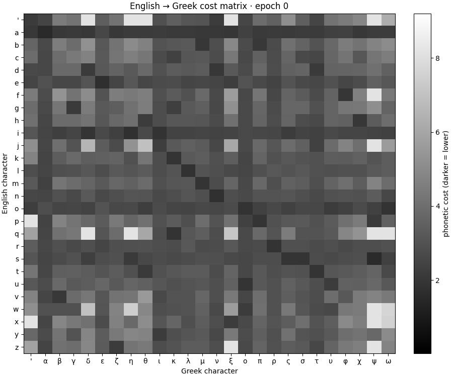
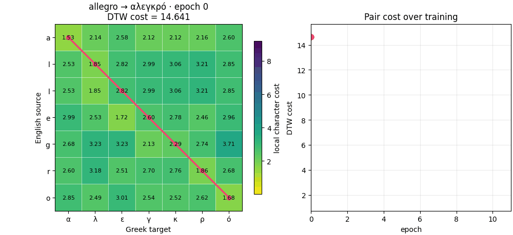

# Cross-Lingual Phonetic Distance

Learn directional character-to-character phonetic cost matrices from named
entity transliteration pairs. The implementation uses NumPy for matrix
initialization and normalization, with a standalone Dynamic Time Warping
(DTW) implementation for alignment and path extraction.

#### Cost matrix over training



#### Case Pair: allegro-αλϵγκρo alignment over training



Refer to [visualization section in readme](#visualization) for more details.

## Requirements

- Python 3.11+
- NumPy
- Matplotlib and Pillow (visualizations only)

The examples below use the existing `test` Conda environment. Replace
`conda run -n test python` with your Python executable if using another
environment.

## Clone

Clone the code without downloading the dataset submodules:

```shell
git clone https://github.com/denizberkin/phonetic-distance.git
```

Clone the code and download both dataset submodules:

```shell
git clone --recurse-submodules https://github.com/denizberkin/phonetic-distance.git
```

If the repository was already cloned without them, download them later with:

```shell
git submodule update --init --recursive
```

## Data

The loader reads only exact files named:

```text
wd_<language>.normalized.aligned.tokens
```

Each row contains three tab-separated fields:

```text
latin_source\tspace separated target characters\toccurrence_count
```

The configured datasets are:

| Language | Data directory |
| --- | --- |
| Katakana | `data/netranslation-coling2018/data` |
| Russian | `data/netranslation-coling2018/data` |
| Armenian | `data/deepchar/data` |
| Greek | `data/deepchar/data` |

Dataset paths, enabled languages, and training settings live in
[`dataset_config.toml`](dataset_config.toml). Language matching needs the exact name between `wd_{lang}.normalized.aligned.tokens`.

The source datasets come from
[NETransliteration-COLING2018](https://github.com/steveash/NETransliteration-COLING2018) and [DeepChar Entities](https://github.com/barseghyanartur/entities).

## Loading data

Load every configured language:

```shell
conda run -n test python -B load_datasets.py
```

Load or preview selected languages:

```shell
conda run -n test python -B load_datasets.py --language greek --preview 3
conda run -n test python -B load_datasets.py --language greek --language armenian
```

The loader can also be imported:

```python
from load_datasets import load_datasets

datasets = load_datasets(languages=["greek"])
pair = datasets["greek"][0]
print(pair.source, pair.target, pair.count)
```

Source and target strings are normalized to Unicode NFC. Diacritics are
preserved.

## Training

Train both directions for every configured language:

```shell
conda run -n test python -B train.py
```

Train one language or direction:

```shell
conda run -n test python -B train.py --language greek
conda run -n test python -B train.py --language greek --direction english_to_target
conda run -n test python -B train.py --language greek --direction target_to_english
```

English-to-target and target-to-English matrices are trained independently;
one is never generated by transposing the other.

### Algorithm

Training follows the paper's iterative procedure:

1. Build the initial cross-character co-occurrence matrix.
2. Convert counts to costs using the negative logarithm of the larger
   row-conditional or column-conditional probability.
3. Align every transliteration pair with DTW.
4. Accumulate source-target character frequencies from the minimum-cost paths.
5. Normalize the new frequencies into the next cost matrix.
6. Stop when the change in row-normalized cost is below
   `convergence_tolerance`, or when `max_iterations` is reached.

The default configuration uses a deterministic 70% training subset and a
normalized-cost convergence threshold of `1e-5`.

## Outputs

The output directory is configured by `training.output_dir` and defaults to
`outputs/`. Training produces separate JSON files such as:

```text
outputs/english_to_greek.json
outputs/greek_to_english.json
```

Each JSON file contains:

- `source_symbols` and `target_symbols`: index-to-character (`i2c`) axes.
- `costs`: the matrix where `costs[i][j]` corresponds to those axes.
- Training metadata including pair count, iterations, convergence, and total
  cost.

A character-to-index (`c2i`) mapping can be reconstructed with:

```python
source_c2i = {char: index for index, char in enumerate(source_symbols)}
target_c2i = {char: index for index, char in enumerate(target_symbols)}
```

## DTW API

DTW is available independently from training:

```python
from utils.dtw import dtw

cost = dtw(source_indices, target_indices, cost_matrix)
cost, path = dtw(
    source_indices,
    target_indices,
    cost_matrix,
    return_path=True,
)
```

The optional forward path contains `(source_index, target_index, local_cost)`
tuples. Training consumes these paths separately to update character-pair
frequencies.

## Visualization

Generate the paper-style English-to-Greek heatmap:

```shell
python scripts/visualize_english_greek.py
```

This writes `assets/english_to_greek.svg`. Darker cells represent lower
phonetic costs.
This is just a replication script of conference paper cost matrix diagram.

### Training animations

Animate the matrix throughout training and the DTW cost/path for the exact
dataset pair allegro → αλεγκρό:

    python scripts/visualize_training_epochs.py

The script repeats the configured deterministic Greek training run and writes
both GIFs to assets/. Epoch 0 is the co-occurrence initialization; later
frames are the learned matrices after each training epoch. Color scales stay
fixed across frames so changes are directly comparable.

## Check

Run the training checks via:

```shell
python tests/test_training.py
```

## Reference

The method implemented here is based on
[Cross-Lingual Phonetic Distance Learning via Transliteration Pairs](https://doi.org/10.1109/SIU66497.2025.11112305),
published through IEEE.


# NOTES

To 9. Multi candidate results add:
- black dot shows bla bla, blue line shows bla bla short legend.
